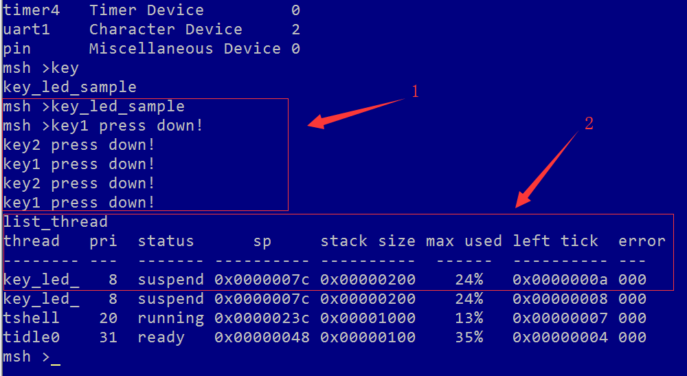

# RT-THREAD PIN设备应用

rt-thread version：4.0.1
硬件平台：野火STM32挑战者 MCU：STM32F4IGT6
开发工具：
1.MDK5.25以上   
2.VSCode  
3.env工具

## PIN设备的操作方法
应用程序通过RT-Thred提供的pin设备管理接口来操作GPIO，函数接口如下表:

<center><font face="黑体">表1.pin设备管理接口API</font></center>

|      方法名称       |       方法描述       |
| :-----------------: | :------------------: |
|    rt_pin_mode()    |     设置引脚模式     |
|   rt_pin_write()    |     设置引脚电平     |
|    rt_pin_read()    |     读取引脚电平     |
| rt_pin_attach_irq() | 绑定引脚中断回调函数 |
| rt_pin_detach_irq() | 脱离引脚中断回调函数 |
| rt_pin_irq_enable() |     使能引脚中断     |

### 1.设置引脚模式
在使用引脚之前需要先设定引脚的工作模式，通过下面函数完成：
```c
void rt_pin_mode(rt_base_t pin, rt_base_t mode);
```
<center><font face="黑体">表2.rt_pin_mode()的输入参数与返回值</font></center>

| **参数** |   **描述**   |
| :------: | :----------: |
|   pin    |   引脚编号   |
|   mode   | 引脚工作模式 |
| **返回** |   **描述**   |
|    无    |      无      |

#### 1.1引脚编号获取
引脚编号是由rt-thread的pin设备管理驱动程序定义的，并不是芯片的引脚号。有2种方式可以获取引脚编号：使用宏定义`GET_PIN(port, pin)`或者查看PIN 驱动文件`drv_gpio.c`。<br>
使用宏定义比较方便。比如要获取ledR的引脚编号，硬件图如`图1.led原理图`：


<center><font face="黑体">图1.led原理图</font></center>

代码如下：

```c
#define LEDR_PIN    GET_PIN(H, 10)
```
再比如要获取key的引脚编号，硬件图如`图2.key原理图`：


<center><font face="黑体">图2.key原理图</font></center>

代码如下：

```c
#define KEY0_PIN    GET_PIN(H, 10)
```

#### 1.2设置引脚模式
RT-Thread目前支持的模式有下面5种：
RT-Thread目前支持的模式有下面5种：
```c
#define PIN_MODE_OUTPUT         0x00    /*推挽输出*/
#define PIN_MODE_INPUT          0x01    /*浮空输入*/
#define PIN_MODE_INPUT_PULLUP   0x02    /*上拉输入*/
#define PIN_MODE_INPUT_PULLDOWN 0x03    /*下拉输出*/
#define PIN_MODE_OUTPUT_OD      0x04    /*开漏输出*/
```

### 2.设置引脚电平
设置引脚电平使用如下函数完成：
```c
void rt_pin_write(rt_base_t pin, rt_base_t value);
```
<center><font face="黑体">表3.rt_pin_write()的输入参数与返回值</font></center>

| **参数** |                      **描述**                      |
| :------: | :------------------------------------------------: |
|   pin    |                      引脚编号                      |
|  value   | 电平逻辑值：PIN_LOW （低电平），PIN_HIGH（高电平） |
| **返回** |                      **描述**                      |
|    无    |                         无                         |

### 3.读取引脚电平
读取引脚电平使用如下函数完成：
```c
int rt_pin_read(rt_base_t pin);
```
<center><font face="黑体">表4.rt_pin_read()的输入参数与返回值</font></center>

| **参数** |                      **描述**                      |
| :------: | :------------------------------------------------: |
|   pin    |                      引脚编号                      |
|  value   | 电平逻辑值：PIN_LOW （低电平），PIN_HIGH（高电平） |
| **返回** |                      **描述**                      |
| PIN_LOW  |                       低电平                       |
| PIN_HIGH |                       高电平                       |

### 4.绑定引脚中断回调函数
如果需要使用引脚的中断功能，那么需要使用如下函数将某个引脚设置为某种中断触发模式，并且绑定中断触发回调函数，当中段发生时，执行回调函数：
```c
rt_err_t rt_pin_attach_irq(rt_int32_t pin, rt_uint32_t mode,
                             void (*hdr)(void *args), void  *args);
```
<center><font face="黑体">表5.rt_pin_attach_irq()的输入参数与返回值</font></center>

| **参数** |               **描述**                |
| :------: | :-----------------------------------: |
|   pin    |               引脚编号                |
|   mode   |             中断触发模式              |
|   hdr    |      中断回调函数，用户自己定义       |
|   args   | 总段回调函数的参数，无时为空：RT_NULL |
| **返回** |               **描述**                |
|  RT_EOK  |               绑定成功                |
|  错误码  |               绑定失败                |

#### 4.1中断触发模式
中断触发有以下5种模式：
```c
#define PIN_IRQ_MODE_RISING             0x00    /*上升沿触发*/
#define PIN_IRQ_MODE_FALLING            0x01    /*下降沿触发*/
#define PIN_IRQ_MODE_RISING_FALLING     0x02    /*上升沿和下降沿都触发*/
#define PIN_IRQ_MODE_HIGH_LEVEL         0x03    /*高电平触发*/
#define PIN_IRQ_MODE_LOW_LEVEL          0x04    /*低电平触发*/
```

### 5.使能引脚中断
绑定好中断出发回调函数以后，就可以通过下面的函数使能引脚中断：
```c
rt_err_t rt_pin_irq_enable(rt_base_t pin, rt_uint32_t enabled);
```
<center><font face="黑体">表6.rt_pin_irq_enable()的输入参数与返回值</font></center>

| **参数** |               **描述**                |
| :------: | :-----------------------------------: |
|   pin    |               引脚编号                |
| enabled | 使能状态：PIN_IRQ_ENABLE（开启），PIN_IRQ_DISABLE（关闭）              |
| **返回** |               **描述**                |
|  RT_EOK  |               使能成功                |
|  错误码  |               使能失败                |

### 6.脱离引脚中断回调函数
绑定好中断出发回调函数以后，如果需要不再执行中断触发回调函数，可以使用如下函数脱离绑定的回调函数：
```c
rt_err_t rt_pin_detach_irq(rt_int32_t pin);
```
<center><font face="黑体">表7.rt_pin_detach_irq()的输入参数与返回值</font></center>

| **参数** |               **描述**                |
| :------: | :-----------------------------------: |
|   pin    |               引脚编号                |
| **返回** |               **描述**                |
|  RT_EOK  |               脱离成功                |
|  错误码  |               脱离失败                |

==注意：==*脱离中断回调函数后，中断并没有关掉，只是不再执行被脱离的回调函数，可以再次绑定该回调函数，当然也可以不绑定该对调函数，去绑定其他回调函数也是可以的*


## PIN设备使用例程
例程功能如下：
1.设置`图1`中LEDR的引脚为输出模式；
2.设置`图2`中KEY1按键、KEY2按键对应的引脚都为输入模式，并且为上升沿触发模式。
3.绑定的中断回调函数为LEDR亮灭函数。
4.按下KEY1灯亮，按下KEY2灯灭。

```c
#include "bsp_key.h"

#define     LEDR_PIN        GET_PIN(H, 10)
#define     KEY1_PIN        GET_PIN(A, 0)
#define     KEY2_PIN        GET_PIN(C, 13)

/*****************************************************************
*   函数：  void ledr_on(void *parameter)
*   参数：  空指针
*   返回值：无
*   说明：  led亮
******************************************************************/
void ledr_on(void *parameter)
{
    rt_kprintf("key1 press down!\n");
    rt_pin_write(LEDR_PIN, PIN_LOW);
}

/*****************************************************************
*   函数：  void ledr_off(void *parameter)
*   参数：  空指针
*   返回值：无
*   说明：  led灭
******************************************************************/
void ledr_off(void *parameter)
{
    rt_kprintf("key2 press down!\n");
    rt_pin_write(LEDR_PIN, PIN_HIGH);
}

/*****************************************************************
*   函数：  static void key_led_entry(void *paraemter)
*   参数：  空指针
*   返回值：无
*   说明：  按键中断控制灯亮灭线程
******************************************************************/
static void key_led_entry(void *paraemter)
{
    while (1)
    {
        rt_thread_mdelay(10);
        rt_pin_attach_irq(KEY1_PIN, PIN_IRQ_MODE_RISING, ledr_on, RT_NULL);     /* 绑定按键1中断回调函数ledr_on，上升沿触发*/
        rt_pin_attach_irq(KEY2_PIN, PIN_IRQ_MODE_RISING, ledr_off, RT_NULL);    /* 绑定按键2中断回调函数ledr_off，上升沿触发*/

        rt_pin_irq_enable(KEY1_PIN, PIN_IRQ_ENABLE);    /* 使能按键1中断 */
        rt_pin_irq_enable(KEY2_PIN, PIN_IRQ_ENABLE);    /* 使能按键2中断 */
    }
    
}

/***************************************************************
*   函数：  static void key_led_sample(int argc, char *argv[])
*   参数：  空指针
*   返回值：无  
*   说明：  启动线程
*****************************************************************/
static void key_led_sample(int argc, char *argv[])
{
    static rt_thread_t key_led_tid = RT_NULL;       /* 定义线程控制块 */

    rt_pin_mode(KEY1_PIN, PIN_MODE_INPUT_PULLDOWN); /* 设置按键1对应引脚的工作模式 */
    rt_pin_mode(KEY2_PIN, PIN_MODE_INPUT_PULLDOWN); /* 设置按键2对应引脚的工作模式 */
    rt_pin_mode(LEDR_PIN, PIN_MODE_OUTPUT);         /* 设置ledr对应引脚的工作模式 */
    rt_pin_write(LEDR_PIN, PIN_HIGH);               /* 设置ledr默认输出高电平，灯不亮 */

    key_led_tid = rt_thread_create("key_led_tid", key_led_entry, RT_NULL,
                                    512, 8, 10);     /* 创建线程 */

    if (key_led_tid != RT_NULL)
    {
        rt_thread_startup(key_led_tid);         /* 启动线程 */
    }
    
}


MSH_CMD_EXPORT(key_led_sample, key led sample); /* 导出至FinSH控制台 */
```
在FinSH终端输入`key_led_sample`，线程开始运行。<br>
当按键1和按键2分别按下后可以看到如下`图3.FinSH终端`信息，同时硬件ledr做出亮灭效果。<br>
输入`list_thread`可以看到该线程运行基本情况信息。


<center><font face="黑体">图3.FinSH终端</font></center>



[RT-Thread PIN设备管理-官网连接](https://www.rt-thread.org/document/site/programming-manual/device/pin/pin/)